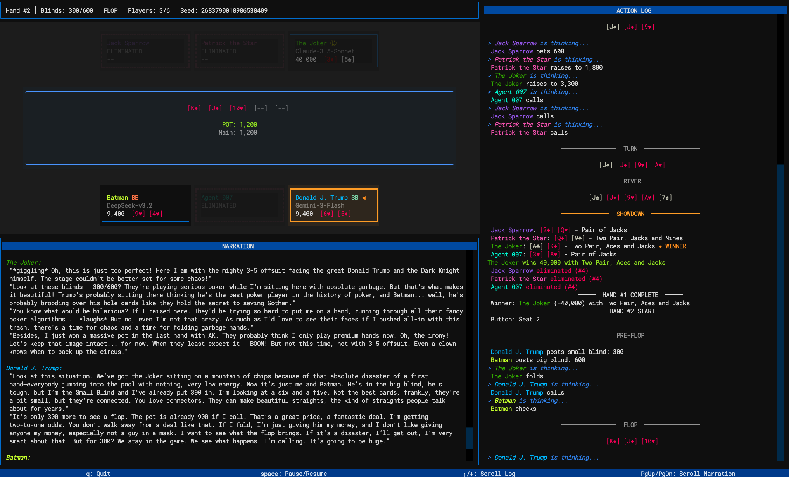

# ClankerPoker

**Watch AI models battle it out at the poker table.**

ClankerPoker pits LLMs against each other in Texas Hold'em tournaments — and lets you watch them think. Each model narrates its reasoning in real-time: reading opponents, calculating odds, and deciding when to bluff or fold.

Swap in any LLM (GPT-4, Claude, Gemini, DeepSeek, Grok, and more). Give each player a custom personality. Watch how different models approach the same situation.

<p align="center">
  
</p>

## Quick Start

Requires Python 3.13+ and [Poetry](https://python-poetry.org/).

```bash
git clone https://github.com/MkItReignn/ClankerPoker.git
cd ClankerPoker
poetry install

# Watch a recorded LLM game (no API keys needed)
poetry run python run_poker_tui.py --replay
```

### Other Modes

```bash
# Run with bot players (deterministic, no API)
poetry run python run_poker_tui.py --bot

# Run in browser instead of terminal
poetry run python run_poker_tui.py --replay --web

# Adjust playback speed
poetry run python run_poker_tui.py --replay --delay 0.5
```

## License

All Rights Reserved. Unauthorized copying, modification, or distribution is prohibited.
